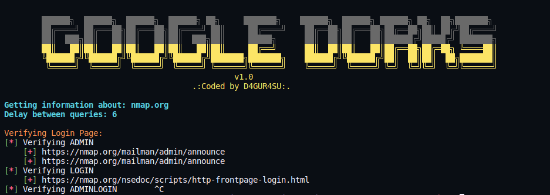

<h1 align="center"> Google-Dorks</h1>

* Google hacking, also named Google dorking, is a hacker technique that uses Google Search and other Google applications to find security holes in the configuration and computer code that websites are using.

    

* we can return specific domains, titles, words, files and more.

    

